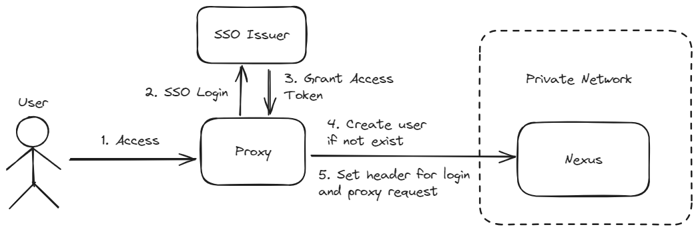

# Nexus OpenID Proxy

This project aim to build a proxy in front of nexus so that the SSO (Keycloak) can be used for authentication to nexus

## Flow

## Prerequisite

> This project is using **Keycloak** as **OAuth Issuer**

### Setup Realm for Nexus

This project is utilizing the [Remote User Token](https://help.sonatype.com/en/authentication-via-remote-user-token.html) of **Nexus**. Please activate http header integration by adding and enabling the **Rut Auth** capability in nexus:

1. Log in as a user with administrative rights.
2. Access the **Server configuration** in the **Administration** menu section on the left.
3. Navigate to the **System** section and select **Capabilities**.
4. Click **Create Capability** and then select **Rut Auth**.
5. Configure the HTTP Header name to the value used by your PKI system - `X-SSO-USER`, and click Create capability.
6. Now click **Realms** under **Security** in the Administration menu on the left.
7. Move the **Rut Auth Realm** to the top of the Active list.
8. Click Save.

> The Nexus Repository on port 8443 should only be accessed by the proxy only, or the firewall should block direct traffic to port 8443 if the source is not the proxy.

## Enviroment Variables

- `ISSUER_BASE_URL`
  - Base url of the OAuth Authorization Server Issuer
  - e.g. `https://some.keycloak.domain/realms/nexus3`
- `BASE_URL`
  - Base url of the application (proxy)
  - e.g. `nexus.some.domain`
- `CLIENT_ID`
  - OAuth Client ID
- `CLIENT_SECRET`
  - OAuth Client Secret
- `NEXUS_HOST`
  - Nexus host name
- `NEXUS_USERNAME`
  - Nexus username of account to create new user
- `NEXUS_Password`
  - Nexus password of account to create new user
